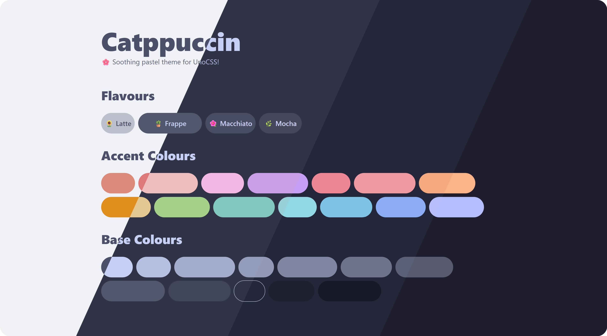
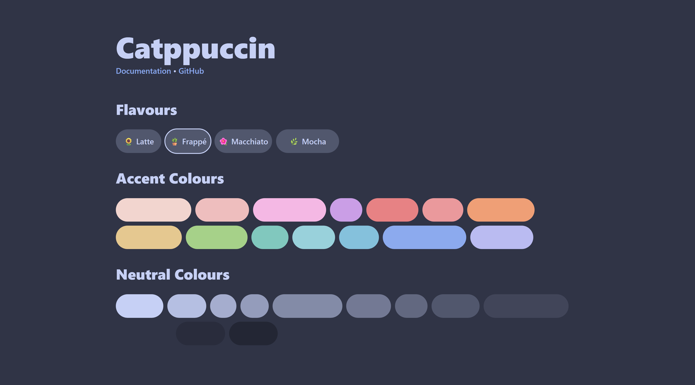
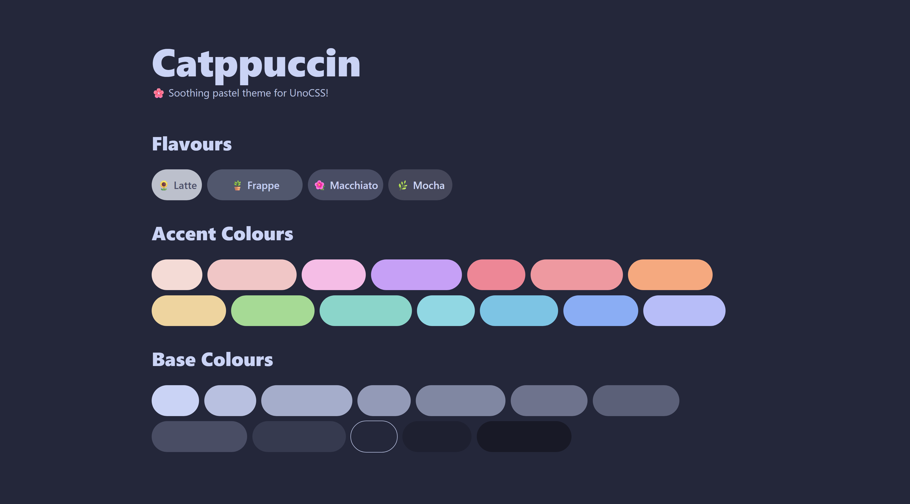
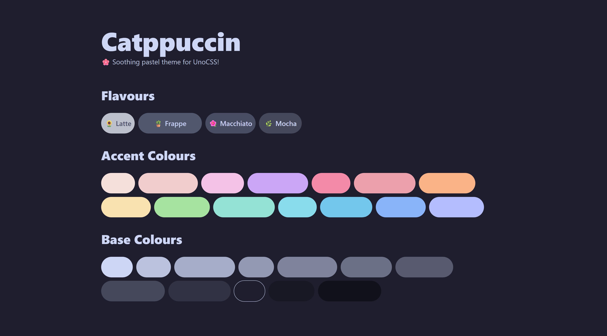

<!-- markdownlint-disable no-inline-html first-line-h1 -->

<h3 align="center">
  
  <br />
  Catppuccin for <a href="https://github.com/unocss/unocss">UnoCSS</a>
</h3>

<p align="center">
  <a href="https://github.com/catppuccin/unocss/stargazers">
    </a>
  <a href="https://github.com/catppuccin/unocss/issues">
    </a>
  <a href="https://github.com/catppuccin/unocss/contributors">
    </a>
</p>

<p align="center">
  
</p>

## Previews

<details>
  <summary>🌻 Latte</summary>
  
</details>
<details>
  <summary>🪴 Frappé</summary>
  
</details>
<details>
  <summary>🌺 Macchiato</summary>
  
</details>
<details>
  <summary>🌿 Mocha</summary>
  
</details>

## Usage

1. Install the npm package `@catppuccin/unocss`

   ```sh
   npm install -D @catppuccin/unocss
   # or
   pnpm add -D @catppuccin/unocss
   # or
   yarn add -D @catppuccin/unocss
   ```

2. Add the preset to your UnoCSS configuration

   ```ts
   // uno.config.ts
   import { presetWind4, defineConfig } from 'unocss';
   import presetCatppuccin from '@catppuccin/unocss';
  
   export default defineConfig({
     presets: [
       presetWind4(),
       presetCatppuccin({
         // options
       })
     ]
   });
   ```

3. Configure the preset if needed. Refer to the [FAQ](#-faq) for documentation

## 🙋 FAQ

- Q: Where can I find the documentation?\
  A: Documentation can be found at <https://unocss.catppuccin.com/docs>

## 💝 Thanks to

- [tuhana](https://github.com/catuhana)

&nbsp;

<p align="center">
  
</p>

<p align="center">
  Copyright &copy; 2021-present <a href="https://github.com/catppuccin" target="_blank">Catppuccin Org</a>
</p>

<p align="center">
  <a href="./LICENCE">
    
  </a>
</p>
